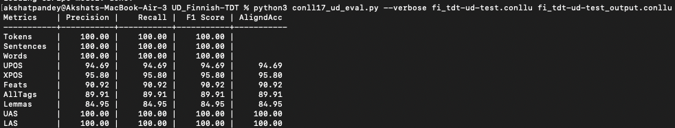
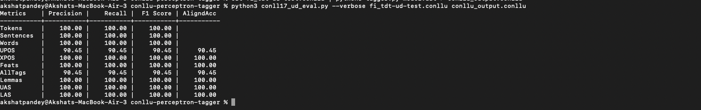
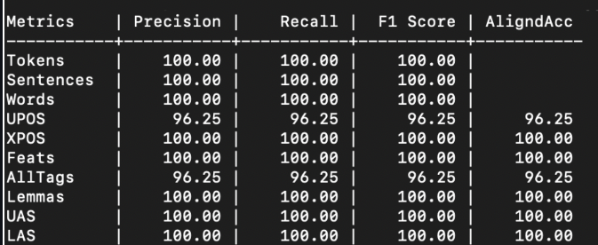

# Part-of-Speech Taggers Comparison Report

## Introduction
In this report, I am comparing the performance of three part-of-speech (POS) taggers applied to the Finnish language dataset (UD_Finnish-TDT) from the Universal Dependencies project. The taggers under evaluation are `udpipe`, a simple `conllu-perceptron-tagger`, and `spacy`.

## Evaluation Metrics
### udpipe
- Precision: 94.69%
- Recall: 94.69%
- F1 Score: 94.69%
- Aligned Accuracy: 94.69%

### Conllu-perceptron-tagger
- Precision: 90.45%
- Recall: 90.45%
- F1 Score: 90.45%
- Aligned Accuracy: 90.45%

### Spacy
- Precision: 96.25%
- Recall: 96.25%
- F1 Score: 96.25%
- Aligned Accuracy: 96.25%

## Evaluation Process
The evaluation was conducted using the CONLL-2017 evaluation script, which provides precision, recall, F1 score and aligned accuracy for the UPOS (Universal Part of Speech) metric.

## Data Preparation
- **udpipe:** The evaluation was performed using udpipe's tagged output files. The output format is already in the CoNLL-U format so it did not require data preparation for feeding it into the evaluation script.
- **Conllu-perceptron-tagger:** The simple conllu-perceptron-tagger was evaluated based on its tagged output files. The output format is already in the CoNLL-U format so it did not require data preparation for feeding it into the evaluation script.

### Spacy POS Tagger
For the Spacy POS Tagger, the .conll files from the Universal Dependencies dataset were converted to Spacy's accepted format using Spacy's utility methods. The following steps were taken:

1. **Converting .conll to Spacy Format:**
   - Spacy provides utility functions under the `spacy_conll` project to convert .conll files to its internal format. These functions ensure compatibility with Spacy's processing pipeline.

2. **Utilizing the Pre-trained Finnish Model:**
   - Spacy's pre-trained Finnish model, named `fi_core_news_md`, served as the basis for creating the tagged output file. This model is specifically designed for processing Finnish text.

3. **Tagging Output File Creation:**
   - The converted .conll files were processed using the `fi_core_news_md` model to generate the tagged output file for evaluation.

## Conclusion
- Udpipe achieved a UPOS aligned accuracy of 94.69%.
- The simple conllu-perceptron-tagger achieved a UPOS aligned accuracy of 90.45%.
- Spacy outperformed both with a UPOS aligned accuracy of 96.25%.

