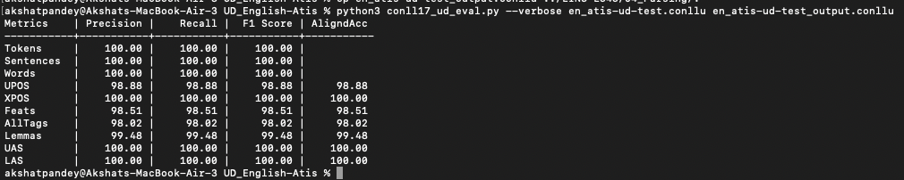

# Dependency Parsing Report

I utilized the following dataset for this practical UD_English-Atis(https://github.com/UniversalDependencies/UD_English-Atis)

The tagged output file is present in this folder named **en_atis-ud-test_output.conllu**

## Evaluation Script Result

## Dependency Tree Analysis

1. **Sentence:** "What are the coach flights between Dallas and Baltimore leaving August tenth and returning August twelve"
   - **Error/Issue:** The word "coach" is incorrectly treated as a proper noun (PROPN) instead of a common noun (NOUN).

2. **Sentence:** "I want a flight from Nashville to Seattle that arrives no later than 3 pm"
   - **Error/Issue:** The phrase "no later than 3 pm" is correctly recognized as an adverbial modifier, but it should be associated with the verb "arrives" rather than the noun "flight."

3. **Sentence:** "I need a flight leaving Kansas City to Chicago leaving next Wednesday and returning the following day"
   - **Error/Issue:** There is redundancy with the word "leaving" in the phrase "leaving next Wednesday." It seems like there's an extra "leaving" that might be a parsing mistake.

4. **Sentence:** "Explain meal codes sd d"
   - **Error/Issue:** It seems to be a simple sentence describing a task rather than a typical dependency tree structure. No significant errors are apparent.

5. **Sentence:** "Show me all flights from Atlanta to San Francisco which leave the day after tomorrow after 5 o'clock pm"
   - **Error/Issue:** The time specification "after 5 o'clock pm" should be associated with the verb "leave" instead of being a separate adverbial modifier.

6. **Sentence:** "I need a flight from Toronto to Montreal reaching Montreal early on Friday"
   - **Error/Issue:** The word "reaching" is incorrectly treated as a verb, but it should be part of the prepositional phrase "reaching Montreal."

7. **Sentence:** "Are there any flights from New York to Montreal Canada leaving on Thursday"
   - **Error/Issue:** The location "Montreal Canada" should be parsed as a single entity, but it is currently separated into two parts.

8. **Sentence:** "Show me ground transportation in Philadelphia on Monday morning"
   - **Error/Issue:** No significant errors appear in this sentence.

9. **Sentence:** "Find a flight from Toronto to San Diego with a layover in DC on Delta Airlines"
   - **Error/Issue:** The airline name "Delta Airlines" should be considered as a single entity, but it is currently separated into two parts.

10. **Sentence:** "What is restriction ap80"
    - **Error/Issue:** No significant errors appear in this sentence.
